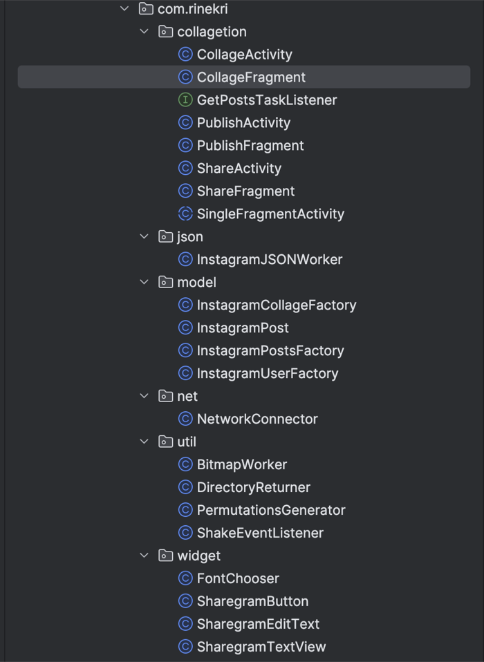
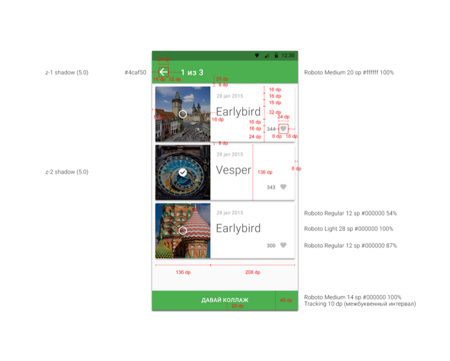

+++

title = "How My First Project Got Me Into the Profession — 10 Years Later"

[taxonomies]
tags = ["android", "career", "review", "experience"]

[extra]
cover = "og-cover.png"

+++

June 16th is a small anniversary for me — 10 years in the profession. To mark the round number, I pulled out my very first project — the one that got me into this field in the first place — and gave it an honest review. Along the way I revisited the whole journey and thought about what it's like to start out today, in the age of AI.

<!-- more -->
## Introduction
June 16, 2026 marks exactly 10 years since I became an Android developer and joined KODE. It's a round date, so I wanted to do more than just note it — I wanted to make it meaningful.

So I came up with an unusual experiment: dig out my very first project — the one I submitted for a competition and used to break into the profession — and honestly review it. Ten years later, through the eyes of someone who now runs reviews, interviews candidates, and mentors interns himself.

It's also a good excuse to look back: where I started, what's changed over the years, and what it's like to get into development now that AI is at your fingertips. The next review like this — of the code, and of myself — I'll probably do again in another 10 years, in 2036.

But first, how I even ended up here.
## How I Got Into IT
## From Finance to Programming
Honestly, in school I had no clear idea what I wanted to be. At first I picked the economics track, like my parents — they're both in finance — and even got a finance diploma from college. But afterward I spent a long time thinking about what to do next, and decided to take a sharp turn into programming. I passed the entrance exams with the bare minimum score, scraping in at the bottom of the cutoff — but it was worth it. I'm really grateful my parents supported that decision: they didn't talk me out of it, only helped. That's essentially how my path into IT began.
## It All Started With a Game Server
The pull toward this started back in childhood. Thanks to my dad, we got a computer early, and the whole family played on it a lot. At some point, through friends from Team Fortress 2, I ended up helping set up a dedicated game server — even though I barely knew anything about it. Pure enthusiasm and a desire to help. And, surprisingly, it worked out: I fixed issues, applied updates, put together nice installers. I did it for free, but I got a real kick out of the process of hunting down unconventional solutions — and out of being recognized and thanked for it. I think that's when I realized I enjoyed solving technical problems.
## Why Android Specifically
When it came to choosing a platform, it was an easy call. At the time, Android felt like the easiest way in: one language, the Android Framework — and you could build your own apps. iOS was similar in principle, but I had neither a Mac nor an iPhone, so that option was off the table on its own. Plus I looked at the phone in my pocket and realized: better to learn on something you can actually touch and run right away. And given how underpowered my computer was, the phone also spared me from a hungry emulator. I've never once regretted the choice — Android opened the door to development for me.
## How I Learned
I didn't really know the language back then, so I started there: found a Java book and spent two hours a day on it — taking notes, writing out examples from the book. Then I moved on to an Android book, but never finished it: I stumbled onto a development competition at KODE and decided to take the risk. What followed was a real hackathon — days of grinding, digging through documentation, and somehow finishing the project by the deadline. I submitted it, braced for failure — and ended up in the top three! The main prize was a chance to work at the company, and of course I said yes. It was simply unbelievable — that's how my dream came true.

I've shared bits of this story before — about choosing the profession, how I learned, and how I settled on Android specifically — as posts on my [LinkedIn](https://www.linkedin.com/in/rinekri).

That very competition project is what we're going to review now.
## The Project Itself
I haven't opened it once since then and don't remember what or how I did things there — so I'll look at it as if from the outside, trying to judge the old code impartially, by the same criteria I now use to review other people's projects.

Of course, there was no GitHub back then — it sat in my Google Drive — so for the sake of this article I uploaded it to a [repository](https://github.com/rinekri/first-project-made-in-2016).

The exact assignment description didn't survive, but the general idea was this: build a small app where you enter an Instagram username, fetch all of that user's posts, assemble a collage out of them, and share it anywhere. I graded it category by category — build, repo setup, libraries, architecture, code quality, design, logic — the full line-by-line breakdown with code snippets is collapsed at the very end of this post if you want the receipts. Here's the bottom line:
## Review Results
So, my decade-old project scored **10 points**. I honestly excluded some criteria because they simply didn't exist in 2016 (Compose, coroutines, skeletons, theme switching) — it would've been unfair to hold my past self to them.

| Section | Points | Verdict |
|---|---|---|
| Build | 1 | built and ran (back in the day) |
| Repository setup | +0 | no Git, no breakdown, no commit history |
| Libraries | +1 | only OkHttp; missed RxJava, Retrofit, a serializer |
| Architecture | +1 | reasonable packages, but no pattern, no Clean, no DI |
| Code quality | +2 | strings extracted, decent split; tidiness suffers |
| Design | +3 | close to the mockup, adaptive, styles and theme |
| Logic | +2 | rotations and basic errors; everything else missed |
| **Total** | **10** | |

What turned out to be surprisingly good: a sensible split into components and packages, extracted and localized strings, working with styles and a theme, an adaptive layout with landscape variants, and thoughtful empty states. It's clear I was thinking about structure and about the user, even if only intuitively.

What's bad: the language — Java instead of Kotlin (that's just how the timing worked out), async work on `AsyncTask` with a blocking `.get()` on the main thread, manual JSON parsing and manual image loading instead of ready-made libraries, no Git or task breakdown, no architectural pattern or DI, responsibilities smeared across layers.

Would I make it through an internship with a project like this today? Honestly — probably not. By today's standards the list of minuses is too serious: a reviewer would immediately latch onto the main-thread work, the lack of architecture, and no Git. But if you allow for the fact that it's 2016, and that I wrote this myself, with no mentor and no understanding of "how it's supposed to be done" — the project shows enough of an engineering foundation for everything else to grow out of it. Which, as it turns out, is exactly what happened.

My main takeaway is this: over ten years the bar for juniors has risen dramatically — what used to be "more or less fine" back then wouldn't pass the very first filter today. But the fundamentals — clean decomposition, meaningful names, care for the user — are valued just as much as ever, and it's far easier to layer a trendy stack on top of that foundation than the other way around.
## What Changed in 10 Years (2016 → 2026)
Laying the stack then and now side by side makes the difference clearer than any score:

| What          | Then (2016)                        | Now (2026)                          |
| ------------- | ----------------------------------- | ----------------------------------- |
| Language      | Java                                | Kotlin                              |
| Async         | `AsyncTask`, homemade threads       | Coroutines / Flow                   |
| Networking    | OkHttp by hand                      | Retrofit / Ktor                     |
| JSON          | manual parsing                      | kotlinx.serialization / Moshi       |
| Images        | own `BitmapWorker` + file cache     | Coil / Glide                        |
| UI            | `ListView` + fragments + XML        | Jetpack Compose / `LazyColumn`      |
| Architecture  | MVC "by feel"                       | MVI / MVVM + Clean Architecture     |
| DI            | none, singletons                    | Dagger / Koin                       |
| Navigation    | `startActivity` directly            | Navigation / Decompose              |
| Process       | no Git                              | Git + CI + PR review (often with AI)|

Almost every line in the right column isn't just "trendier" — it's a way to avoid the exact mistakes I broke down above: coroutines get rid of `AsyncTask.get()` on the main thread, Coil removes the manual bitmap fiddling, DI removes global singletons holding a `Context`.
## What I Did These 10 Years

<figure class="review-chart">
<svg viewBox="0 0 640 190" width="640" height="190" preserveAspectRatio="xMidYMid meet" role="img" aria-labelledby="timeline-title timeline-desc" xmlns="http://www.w3.org/2000/svg">
  <title id="timeline-title">10-year journey, 2016 → 2026</title>
  <desc id="timeline-desc">2016 junior at KODE, 2018 first talks and growth into a tech lead, 2021 own tools and CI/CD, 2023 leveling framework and department lead, 2026 senior, mentor, and a personal blog</desc>
  <style>
    .review-chart text { font-family: -apple-system, BlinkMacSystemFont, "Segoe UI", Roboto, sans-serif; }
    .review-chart .year  { fill: var(--primary, #1e1e1e); font-size: 14px; font-weight: 600; }
    .review-chart .label { fill: var(--secondary, #6c6c6c); font-size: 11.5px; }
    .review-chart .line  { stroke: var(--border, #eee); stroke-width: 2; }
    .review-chart .tick  { stroke: var(--border, #eee); stroke-width: 1.5; }
    .review-chart .dot   { fill: var(--accent, #2f5942); }
  </style>
  <line class="line" x1="40" y1="95" x2="600" y2="95" stroke-linecap="round"></line>
  <circle class="dot" cx="70" cy="95" r="6"></circle>
  <line class="tick" x1="70" y1="89" x2="70" y2="66"></line>
  <text class="year" x="70" y="52" text-anchor="middle">2016</text>
  <text class="label" x="70" y="118" text-anchor="middle">
    <tspan x="70" dy="0">Junior,</tspan>
    <tspan x="70" dy="15">KODE</tspan>
  </text>
  <circle class="dot" cx="195" cy="95" r="6"></circle>
  <line class="tick" x1="195" y1="101" x2="195" y2="124"></line>
  <text class="year" x="195" y="145" text-anchor="middle">2018</text>
  <text class="label" x="195" y="70" text-anchor="middle">
    <tspan x="195" dy="0">GDG talks,</tspan>
    <tspan x="195" dy="15">growing into tech lead</tspan>
  </text>
  <circle class="dot" cx="320" cy="95" r="6"></circle>
  <line class="tick" x1="320" y1="89" x2="320" y2="66"></line>
  <text class="year" x="320" y="52" text-anchor="middle">2021</text>
  <text class="label" x="320" y="118" text-anchor="middle">
    <tspan x="320" dy="0">Own tools,</tspan>
    <tspan x="320" dy="15">CI/CD</tspan>
  </text>
  <circle class="dot" cx="445" cy="95" r="6"></circle>
  <line class="tick" x1="445" y1="101" x2="445" y2="124"></line>
  <text class="year" x="445" y="145" text-anchor="middle">2023</text>
  <text class="label" x="445" y="70" text-anchor="middle">
    <tspan x="445" dy="0">Leveling framework,</tspan>
    <tspan x="445" dy="14">department lead</tspan>
  </text>
  <circle class="dot" cx="570" cy="95" r="6"></circle>
  <line class="tick" x1="570" y1="89" x2="570" y2="66"></line>
  <text class="year" x="570" y="52" text-anchor="middle">2026</text>
  <text class="label" x="570" y="118" text-anchor="middle">
    <tspan x="570" dy="0">Senior,</tspan>
    <tspan x="570" dy="15">mentor, blog</tspan>
  </text>
</svg>
<figcaption>The journey from junior to senior mentor — 2016 → 2026</figcaption>
</figure>

Ten years have passed since that competition project — and the route turned out to be an eventful one. I started as the junior who wrote all that code above, and gradually grew into a senior, tech lead, and mentor. Here's a short rundown of what I've been up to all this time.

<div class="stat-strip">
<div class="stat-tile"><svg width="26" height="26" viewBox="0 0 24 24" fill="none" stroke="currentColor" stroke-width="2" stroke-linecap="round" stroke-linejoin="round"><rect x="2" y="7" width="20" height="14" rx="2" ry="2"></rect><path d="M16 21V5a2 2 0 0 0-2-2h-4a2 2 0 0 0-2 2v16"></path></svg><span class="stat-num">~18</span><span class="stat-label">projects shipped</span></div>
<div class="stat-tile"><svg width="26" height="26" viewBox="0 0 24 24" fill="none" stroke="currentColor" stroke-width="2" stroke-linecap="round" stroke-linejoin="round"><path d="M17 21v-2a4 4 0 0 0-4-4H5a4 4 0 0 0-4 4v2"></path><circle cx="9" cy="7" r="4"></circle><path d="M23 21v-2a4 4 0 0 0-3-3.87"></path><path d="M16 3.13a4 4 0 0 1 0 7.75"></path></svg><span class="stat-num">~24</span><span class="stat-label">engineers led</span></div>
<div class="stat-tile"><svg width="26" height="26" viewBox="0 0 24 24" fill="none" stroke="currentColor" stroke-width="2" stroke-linecap="round" stroke-linejoin="round"><path d="M20.59 13.41L13.42 20.58a2 2 0 0 1-2.83 0L2.59 12.58a2 2 0 0 1-.59-1.42V6a2 2 0 0 1 2-2h5.17a2 2 0 0 1 1.42.59l8 8a2 2 0 0 1 0 2.83z"></path><line x1="7" y1="7" x2="7.01" y2="7"></line></svg><span class="stat-num">30</span><span class="stat-label">competency domains mapped</span></div>
<div class="stat-tile"><svg width="26" height="26" viewBox="0 0 24 24" fill="none" stroke="currentColor" stroke-width="2" stroke-linecap="round" stroke-linejoin="round"><path d="M21 16V8a2 2 0 0 0-1-1.73l-7-4a2 2 0 0 0-2 0l-7 4A2 2 0 0 0 3 8v8a2 2 0 0 0 1 1.73l7 4a2 2 0 0 0 2 0l7-4A2 2 0 0 0 21 16z"></path><polyline points="3.27 6.96 12 12.01 20.73 6.96"></polyline><line x1="12" y1="22.08" x2="12" y2="12"></line></svg><span class="stat-num">2</span><span class="stat-label">open-source Gradle plugins</span></div>
<div class="stat-tile"><svg width="26" height="26" viewBox="0 0 24 24" fill="none" stroke="currentColor" stroke-width="2" stroke-linecap="round" stroke-linejoin="round"><path d="M12 1a3 3 0 0 0-3 3v8a3 3 0 0 0 6 0V4a3 3 0 0 0-3-3z"></path><path d="M19 10v2a7 7 0 0 1-14 0v-2"></path><line x1="12" y1="19" x2="12" y2="23"></line><line x1="8" y1="23" x2="16" y2="23"></line></svg><span class="stat-num">2</span><span class="stat-label">conference talks</span></div>
</div>

## Projects
Over the years I've taken part in roughly a dozen and a half projects across a wide spread of industries:

<div class="chip-row">
<span class="chip">Fintech &amp; Banking</span>
<span class="chip">Maps &amp; Navigation</span>
<span class="chip">Voice Assistants</span>
<span class="chip">Logistics &amp; Delivery</span>
<span class="chip">Gaming</span>
<span class="chip">Aviation</span>
<span class="chip">Real Estate</span>
<span class="chip">Telecom</span>
<span class="chip">Corporate Services</span>
</div>

On some I was a regular developer, on others a tech lead — responsible for architecture, reviews, talking with the client, and making sure the team actually shipped. The range of work spans everything from screen layout to research-flavored things like WebRTC integration and call-quality scoring (MOSMean Opinion Score — a 1–5 rating of perceived call audio quality, gathered from real listeners or estimated algorithmically.). Along the way I also grew into leading the whole Android department — these days that's on the order of two dozen engineers, organized into sub-teams under deputy leads, with tech leads running a separate technical vertical across those same teams — a structure I helped put in place.

## Infrastructure and Build
A separate, sizable chunk of the work is things the user never sees but that save the team time every day:
* set up CI/CD: build and publish pipelines, delivering builds to Firebase App Distribution, signing, and so on;
* wrote my own Gradle plugin for automated build publishing — it started in 2022 as a one-off tool for a single project, and by now has grown into a company-wide standard, open-sourced as `build-publish-plugin`: consistent artifact naming, changelog generation, and variant-aware uploads to Firebase App Distribution, Confluence, Telegram, and Slack;
* wrote and open-sourced `app-quality-plugin`, centralizing Detekt and ktlint checks across every module of every project behind one `prePushCheck` task;
* worked on build speed: remote/configuration cache, migrating to non-transitive R classes, support for multiple keystores, later replacing Spotless with the Ktlint CLI company-wide for faster checks, and standing up a self-hosted proxying Maven repository for dependency resolution;
* also stood up a self-hosted Telegram Bot API server, mostly to get past Telegram's 50MB upload cap for distributing builds.

<div class="metric-strip">
<div class="metric-tile"><span class="metric-name">Build time (remote/config cache)</span><span class="metric-values"><span class="metric-before">7 min</span><span class="metric-arrow">→</span>2.5 min</span><span class="metric-speedup">~2.8x faster</span></div>
<div class="metric-tile"><span class="metric-name">Dependency resolution (self-hosted Maven proxy)</span><span class="metric-values"><span class="metric-before">12 min</span><span class="metric-arrow">→</span>&lt;10 sec</span><span class="metric-speedup">~70x faster</span></div>
</div>

<div class="repo-cards">
<a class="repo-card" href="https://github.com/appKODE/build-publish-plugin" target="_blank" rel="noopener noreferrer"><span class="repo-card-name">appKODE/build-publish-plugin</span><span class="repo-card-desc">Gradle plugin — artifact naming, changelogs, variant-aware uploads to Firebase App Distribution, Confluence, Telegram, Slack</span></a>
<a class="repo-card" href="https://github.com/appKODE/app-quality-plugin" target="_blank" rel="noopener noreferrer"><span class="repo-card-name">appKODE/app-quality-plugin</span><span class="repo-card-desc">Gradle plugin — centralizes Detekt + ktlint checks behind one prePushCheck task</span></a>
</div>

<blockquote class="pull-quote">Found a legacy build script quietly eating everyone's time — talked two engineers into rewriting it from JRuby into Rust. It came out hundreds of times faster.</blockquote>

## Tools I've Built
I've always liked closing out routine work with utilities:
* **LogAnalyzer** — a Kotlin Multiplatform app for parsing logs (filtering, highlighting, format conversion);
* an alternative to **Danger** for GitLab — to automatically check merge requests against the team's rules;
* **Tags Setter** — a utility that auto-tags notes based on folder hierarchy;
* an interactive Android developer roadmap — a skills map for growing the team.

Some of this is internal tooling with no public links, but the logic is the same as in the open-source pieces. For example, I put a minimal reproduction for my article about a dark-mode bug up on GitHub — [DarkModeBugSample](https://github.com/rinekri/DarkModeBugSample) ([writeup on /projects/](/projects/#project-darkmode-bug)).

## Teaching and Mentoring
The further along I got, the more I was drawn not just to writing code, but to passing on what I'd learned:
* recorded a mini Kotlin course (11 lessons for beginners) for an online school about six years ago — it's not publicly available, unfortunately, but I've [told the story](https://www.linkedin.com/posts/rinekri_i-unlocked-an-old-memory-about-how-i-recorded-activity-7209637327516708865-4o_m) of recording it separately;
* launched an internship and mentoring program in the department — the very one I now use to run future juniors through, with 12+ mentees having gone through it by now, including hosting a live masterclass for internship applicants;
* introduced code review where there wasn't any, and restarted internal tech talks as a recurring biweekly series;
* set up regular company-wide biweekly 1-on-1s (remote employees included), took on department documentation, started interviewing candidates, and put quarterly performance reviews in place for the whole department, not just newcomers.

Funny enough, I now know junior evaluation from the other side of the fence — which is exactly what made reviewing my own old code feel so grounded.

## Building a Leveling Framework
One of the things I'm proudest of doesn't show up in a diff at all: a company-wide engineering leveling framework I designed to replace the usual fuzzy Junior/Middle/Senior titles.

Instead of vague labels, it's built around **eight levels (L0–L7) mapped to radius of impact** — every level is defined by concrete, observable behavior ("implemented X in context Y, can explain the trade-offs") instead of "knows" or "understands," which are impossible to actually evaluate.

<figure class="review-chart">
<svg viewBox="0 0 640 280" width="640" height="280" preserveAspectRatio="xMidYMid meet" role="img" aria-labelledby="levels-title levels-desc" xmlns="http://www.w3.org/2000/svg">
  <title id="levels-title">L0–L7 leveling framework, by radius of impact</title>
  <desc id="levels-desc">L0 onboarding, L1 do it yourself, L2 do it autonomously, L3 fix others' work, L4 improve the system, L5 influence the team, L6 influence the product, L7 influence the organization</desc>
  <style>
    .review-chart text { font-family: -apple-system, BlinkMacSystemFont, "Segoe UI", Roboto, sans-serif; }
    .review-chart .cat  { fill: var(--secondary, #6c6c6c); font-size: 13px; }
    .review-chart .axis { stroke: var(--border, #eee); stroke-width: 1; }
    .review-chart .bar  { fill: var(--accent, #2f5942); }
  </style>
  <line class="axis" x1="212" y1="4" x2="212" y2="266"></line>
  <text class="cat" x="204" y="22" text-anchor="end">L0 · Onboarding</text>
  <rect class="bar" x="212" y="10" width="40" height="16" rx="4"></rect>
  <text class="cat" x="204" y="56" text-anchor="end">L1 · Do It Yourself</text>
  <rect class="bar" x="212" y="44" width="89" height="16" rx="4"></rect>
  <text class="cat" x="204" y="90" text-anchor="end">L2 · Do It Autonomously</text>
  <rect class="bar" x="212" y="78" width="137" height="16" rx="4"></rect>
  <text class="cat" x="204" y="124" text-anchor="end">L3 · Fix Others' Work</text>
  <rect class="bar" x="212" y="112" width="186" height="16" rx="4"></rect>
  <text class="cat" x="204" y="158" text-anchor="end">L4 · Improve the System</text>
  <rect class="bar" x="212" y="146" width="234" height="16" rx="4"></rect>
  <text class="cat" x="204" y="192" text-anchor="end">L5 · Influence the Team</text>
  <rect class="bar" x="212" y="180" width="283" height="16" rx="4"></rect>
  <text class="cat" x="204" y="226" text-anchor="end">L6 · Influence the Product</text>
  <rect class="bar" x="212" y="214" width="331" height="16" rx="4"></rect>
  <text class="cat" x="204" y="260" text-anchor="end">L7 · Influence the Organization</text>
  <rect class="bar" x="212" y="248" width="380" height="16" rx="4"></rect>
</svg>
<figcaption>Radius of impact — from shipping your own tasks (L0) to shaping the whole organization (L7)</figcaption>
</figure>

Underneath that sits a genuinely large technical matrix — separate competency ladders across roughly thirty domains:

<div class="chip-row">
<span class="chip">Kotlin</span>
<span class="chip">Java</span>
<span class="chip">Git</span>
<span class="chip">Gradle &amp; Plugins</span>
<span class="chip">Networking</span>
<span class="chip">DI</span>
<span class="chip">Coroutines / RxJava</span>
<span class="chip">Performance</span>
<span class="chip">Security</span>
<span class="chip">Storage</span>
<span class="chip">Navigation</span>
<span class="chip">CI/CD</span>
<span class="chip">Publishing</span>
<span class="chip">Crash Reporting</span>
<span class="chip">AOSP</span>
<span class="chip">KMP</span>
<span class="chip">iOS / Swift</span>
<span class="chip">Product Thinking</span>
<span class="chip">Team Leading</span>
<span class="chip">Open Source</span>
<span class="chip">Backend</span>
<span class="chip">Frontend</span>
<span class="chip">UI · View</span>
<span class="chip">UI · Compose</span>
</div>

On top of that, levels are cross-checked against a formula-driven 360° survey, specifically to keep promotion decisions from coming down to just one manager's gut feeling.

<blockquote class="pull-quote">Designing a system like that turned out to be a different kind of hard than any code review — the interesting part isn't picking the levels, it's making every criterion falsifiable enough that two different reviewers land on the same answer.</blockquote>

## Talks
I've spoken at GDG / DevFest conferences a few times:
* <svg class="mini-icon" width="16" height="16" viewBox="0 0 24 24" fill="none" stroke="currentColor" stroke-width="2" stroke-linecap="round" stroke-linejoin="round"><path d="M12 1a3 3 0 0 0-3 3v8a3 3 0 0 0 6 0V4a3 3 0 0 0-3-3z"></path><path d="M19 10v2a7 7 0 0 1-14 0v-2"></path><line x1="12" y1="19" x2="12" y2="23"></line><line x1="8" y1="23" x2="16" y2="23"></line></svg>**"RecyclerView at Full Power: A Library Breakdown"** — at DevFest Kaliningrad 2018 (full entry on [/speaking/](/speaking/)). Covered the different ways to build lists on Android and which libraries to use for it. What's left: a [Habr article](https://habr.com/ru/companies/redmadrobot/articles/428525/), a [repo with examples](https://github.com/appKODE/recyclerview_adapters) (the classics, Epoxy, Groupie, AdapterDelegates), and a [YouTube recording](https://www.youtube.com/watch?v=d8lh84BJGvM).
* <svg class="mini-icon" width="16" height="16" viewBox="0 0 24 24" fill="none" stroke="currentColor" stroke-width="2" stroke-linecap="round" stroke-linejoin="round"><path d="M12 1a3 3 0 0 0-3 3v8a3 3 0 0 0 6 0V4a3 3 0 0 0-3-3z"></path><path d="M19 10v2a7 7 0 0 1-14 0v-2"></path><line x1="12" y1="19" x2="12" y2="23"></line><line x1="8" y1="23" x2="16" y2="23"></line></svg>**"Building Apps for the Google Voice Assistant"** — another GDG talk, co-presented with colleagues, about building skill-apps for the voice assistant. I had the material for it because I was tech lead across a cluster of voice-assistant projects for a large enterprise client around that time — one delivery became something of a flagship in that space and opened the door to more work like it. [YouTube recording](https://www.youtube.com/watch?v=TEEY91ZN7a8).

## Blog and Open Source
<svg class="mini-icon" width="16" height="16" viewBox="0 0 24 24" fill="none" stroke="currentColor" stroke-width="2" stroke-linecap="round" stroke-linejoin="round"><path d="M9 19c-5 1.5-5-2.5-7-3m14 6v-3.87a3.37 3.37 0 0 0-.94-2.61c3.14-.35 6.44-1.54 6.44-7A5.44 5.44 0 0 0 20 4.77 5.07 5.07 0 0 0 19.91 1S18.73.65 16 2.48a13.38 13.38 0 0 0-7 0C6.27.65 5.09 1 5.09 1A5.07 5.07 0 0 0 5 4.77a5.44 5.44 0 0 0-1.5 3.78c0 5.42 3.3 6.61 6.44 7A3.37 3.37 0 0 0 9 18.13V22"></path></svg>And then there's this blog — [rinekri.com](https://rinekri.com) — also part of the journey: here I dig into technical stories (like investigating a dark-mode bug — [minimal reproduction](https://github.com/rinekri/DarkModeBugSample) and the [bug report to Google](https://issuetracker.google.com/issues/335782501)) and write about how I got into the profession. I put code up on [GitHub](https://github.com/rinekri), and occasionally post on [X](https://x.com/rinekri).
## What Stayed the Same
Here's what hasn't changed in ten years — and to me, this is the main point. When I now look at interns as a mentor, I'm not looking at knowledge of the trendy stack (that's easy to pick up), but at a handful of things that turned out to matter far more:
* curiosity for its own sake — diving into something unfamiliar just to understand how it works, not because a ticket demanded it;
* a bias toward simplifying instead of over-engineering — protecting whoever inherits the code from complexity that isn't earning its keep;
* treating mentoring and code review as something you build proactively — I've re-launched some version of the same mentoring program at every company I've worked at;
* caring about the person on the other end of the code, whether that's a user staring at an empty state or a teammate reading my pull request;
* knowing when to step back and hand ownership to someone else — probably the thing I still have to consciously work at the most, same as ten years ago.

The stack changes every couple of years; this doesn't. Learning Compose on top of a solid foundation is far easier than the other way around.
## Advice for Juniors Starting Out Now, in the Age of AI
The most interesting part of this experiment for me wasn't the score — it was the question: what's it like to start out now, with AI around?

**How this would be written today.** The same project would get built by a junior today on Kotlin + Compose + Coroutines + Retrofit + Coil in a couple of evenings, instead of a month of brute-forcing it from books like I did. Most of the boilerplate would be written by Copilot or Cursor, and Claude or ChatGPT would explain any error you didn't understand.

**AI as an endlessly patient reviewer.** When I was learning (I wrote about this in a post called "How I learned Android"), there was no one around to point out my mistakes — just books and documentation. Today's junior would have AI flag, in seconds, the main-thread networking, the busy-wait in `PermutationsGenerator`, the `Context` leak in the singleton, and the manual parsing where a library exists. Everyone effectively got a personal 24/7 mentor — a huge lever.

Here's what that actually looks like, on one of the real bugs from my old project (the [full breakdown](#the-full-category-by-category-review) is at the bottom of this post):

```java
public HashSet<ArrayList<String>> getCombinations(int size) {
    GenerateExecutor mExecutor = new GenerateExecutor();
    mExecutor.execute(new RunnableForGenerateExecutor());

    while (true) {
        if (mCombinations.size() >= 1) {
            try {
                Thread.sleep(1000);
            } catch (InterruptedException e) { }
            return mCombinations;
        }
    }
}
```

<div class="ai-review-comment"><span class="ai-review-label">AI review comment</span>This busy-waits on a shared <code>HashSet</code> with zero synchronization and hopes <code>Thread.sleep(1000)</code> gives the background thread enough time to finish. Wrap the work in a coroutine and <code>await</code> the result instead — no polling, no race, no magic delay.</div>

**But without understanding, it's a trap.** AI will just as happily generate the same mistakes if you don't know what to ask it or how to check its answer. It won't make architectural decisions for you, and "vibe coding" without understanding what's actually happening is just technical debt written faster. I treat AI pragmatically myself: it's a tool inside the usual Git / CI / review process (I judge those same AI review bots by their signal-to-noise ratio and actual usefulness), not a magic button.

**The bar shifted, it didn't drop.** AI raised the "floor": syntax, boilerplate, "wire up a library" — all of that is now trivial and barely valued. So today a junior isn't expected to know the stack so much as to exercise judgment: the ability to design, debug, understand *why* code works, and catch the moment AI is confidently wrong. Paradoxically, the foundation from the previous section has become more important, not less.

So here's my advice for people starting out now:
* use AI to **move faster and learn**, not to skip understanding;
* ask AI to **explain and review** your code, not just write it for you;
* build a pet project and run it through an AI review — like a mentor — and then work through every comment yourself;
* every time, ask yourself: *why* does the suggested code work? If you can't answer, don't paste it in.

One last, personal thing. Ten years ago, what made me a developer was the fight with the incomprehensible — when, up against a deadline, I had to work through by hand what now gets written by autocomplete. AI removes a lot of that pain, and that's great. But it doesn't remove the need to think — and in an age when writing code has become easy, the ability to think is valued more than ever.
## See You in Ten Years
If I could say something now to my 2016 self — the one grinding through nights before the deadline on this project — I'd probably tell him it wasn't for nothing. That "somehow put together" code, with its main-thread work and busy-waits, got me into a profession I love, and taught me the main lesson: don't be afraid to dive into the unknown and figure it out.

Over these ten years I'm grateful to a lot of people: Android, for opening the door; my parents, for backing a risky pivot; KODE, for that competition and everything that came after; and the people around me I learned from. The bar has risen sky-high since then, the tools have changed almost completely, but the thrill of hunting down an unconventional solution is exactly the same as it was back then, on that game server.

So the next review — of this project, and of myself — I'll do again in another ten years, in 2036. I'm curious what I'll have to say then about the code I'm writing now (and how much of it will turn out to be me, and how much AI). Deal?
## The Full Category-by-Category Review

<details>
<summary>Expand for the line-by-line breakdown — Build, Repository Setup, Libraries, Architecture, Code Quality, Design, Logic, and what stood out along the way (code snippets included)</summary>
<nav class="detail-toc">
<ul>
<li><a href="#build">Build</a></li>
<li><a href="#repository-setup">Repository Setup</a></li>
<li><a href="#libraries">Libraries</a></li>
<li><a href="#architecture">Architecture</a></li>
<li><a href="#code-quality">Code Quality</a></li>
<li><a href="#design">Design</a></li>
<li><a href="#logic">Logic</a></li>
<li><a href="#what-stood-out">What Stood Out During a Closer Review</a></li>
</ul>
</nav>

<p class="detail-h2" id="build">Build</p>

It matters that a project builds and runs. Sometimes projects get submitted for review that don't meet even that bar.

Of course, my project didn't run, because a lot has changed since then:
* Had to bump AGP from `1.5.0` to `8.1.2`
* Declare the namespace in `build.gradle` instead of `AndroidManifest.xml`
* Set `android:exported` on every Activity in the manifest
* Switch dependencies from `compile` to `implementation`
* Use `google()` and `mavenCentral()` instead of `jcenter()`
* Set `android.nonFinalResIds=false` in `gradle.properties`
* Update `gradle-wrapper.jar`
* Bump Gradle from `2.8` to `8.2.1` in `gradle-wrapper.properties`
* Update `gradlew` and `gradlew.bat`
* Replace the reference to `R.attr.colorPrimaryDark` with `android.R.attr.colorPrimaryDark`

If someone sent me a project like this today, I'd flag it as a serious minus — a reviewer shouldn't have to make the project work themselves. But since this project was made a long time ago, I'll give the author a pass here. And at the time, it did all work.

Total: 1 point for the fact that it built and ran back in its day.
<p class="detail-h2" id="repository-setup">Repository Setup</p>

This covers the following criteria:
* Task breakdown in the README
* Task estimation
* A clear commit history

I have none of this: I never wrote a breakdown back then, never estimated tasks, and didn't use Git at all. So the project gets zero points for this section.

**Total:**
1 point + 0 = 1 point.
<p class="detail-h2" id="libraries">Libraries</p>

What I'd want to see in a project like this today:
* Kotlin
* Kotlin Coroutines
* Jetpack Compose
* OkHttp
* Retrofit / Ktor
* Gson / Moshi / Kotlinx Serialization
<p class="detail-h3">Kotlin</p>

My project uses Java. If I'd made it a year later, that would be fair to criticize, but Google only announced [official Kotlin support on Android](https://blog.jetbrains.com/kotlin/2017/05/kotlin-on-android-now-official/) in 2017.
<p class="detail-h3">Kotlin Coroutines</p>

Stable Kotlin Coroutines showed up much later, so there's no way I could have used them. For async work I used `AsyncTask`s. At the time that was probably more or less fine, though my very first project at the company already used RxJava, so it'd be fair to expect the same here.
<p class="detail-h3">Jetpack Compose</p>

Jetpack Compose obviously didn't exist yet either, so layout was simpler — there wasn't much to choose from in the first place.
<p class="detail-h3">OkHttp</p>

This library definitely existed at the time, so I'd expect the project to use it both now and back then. And, to my surprise, I did use it! So that one's a pass.
<p class="detail-h3">Retrofit / Ktor</p>

I couldn't have been expected to use Ktor back then, but Retrofit was also googleable and could've been dropped in without much trouble. So I could've earned a point here too, but no such luck.
<p class="detail-h3">Gson / Moshi / Kotlinx Serialization</p>

Both Gson and Moshi already existed at the time — Moshi's first version came out in 2015, and Gson all the way back in 2008 — so it would've been reasonable to use one of them to handle JSON and keep the code cleaner and easier to follow. But I parsed and built everything by hand, no libraries. Sad, but that's how it is.

**Total:**
1 point + 1 point for OkHttp = 2 points.
In my case I could've gotten: 1 point for RxJava, 1 point for a serializer, 1 point for Retrofit.
<p class="detail-h2" id="architecture">Architecture</p>

What I'd want to see in a project like this today:
* MVI / MVVM
* Clean Architecture
* DI
<p class="detail-h3">MVI / MVVM</p>

For the UI layer pattern I used MVC. You could say there was no pattern at all. I think even MVP could've been implemented at the time without much trouble, so this is a clear shortfall.
<p class="detail-h3">Clean Architecture</p>

I hadn't even heard of Clean Architecture back then, but somehow managed to distribute classes reasonably sensibly by purpose: widgets, net, ui, model, json.

It's not actually that bad — the code isn't dumped into one pile, and it's generally clear where things live. I think expecting full Clean Architecture understanding from an intern is excessive, so I'll give this part a pass.



But what could've been improved:
* Split by feature: posts, collage, share
* Merge json and net together
* Move entities out of model into entity, and rename model to domain
* For some reason all the logic classes are named Factory — at minimum I'd rename them to Interactor
<p class="detail-h3">DI</p>

In principle, any solution that let you provide dependencies into classes from the outside would've worked here. Some things in the project are passed in that way, but not all — some classes are created inside methods, which isn't great. For example, in the `InstagramCollageFactory` class, in the `generateCombinations` method:
```java
private void generateCombinations(int size) {  
    PermutationsGenerator permutationsGenerator = new PermutationsGenerator();  
    sInstagramImgsCombinations = permutationsGenerator.getCombinations(size);  
}
```
I'd have liked to see more attention paid to this in the project, so this is another shortfall.

**Total:**
2 points + 1 point for reasonable class distribution = 3 points.
<p class="detail-h2" id="code-quality">Code Quality</p>

<p class="detail-h3">No Hardcoded Strings</p>

All the strings used in the UI are extracted into `strings.xml`, and there are even multiple localizations, even though the assignment didn't require it. That said, there are a few places with hardcoded strings, but they're log messages, so I'll let that slide.
<p class="detail-h3">Code Split Into Components</p>

The main things worth praising here:
* As already mentioned, there's a split into classes by package, which helps you navigate the code better.
* Each component has a clear purpose and contains exactly what you'd expect to find in it. For example: screens are split into fragments; there are classes responsible for posts, the collage, the user; there are separate classes for networking, and so on. Overall, I never got the sense that anything was missing or redundant.
* There are some base entities in place, so there's no duplicated code.

What could be improved:
* Maybe I shouldn't have used Activities that just display a single fragment and contain no logic of their own — navigation could've been handled purely through fragments instead.
* Putting caching logic inside a data class (`InstagramPost`) also looks wrong — there's a clear mixing of concerns, and the class ended up doing more than it should.
<p class="detail-h3">Code Tidiness</p>

<p class="detail-h4">Magic Numbers</p>

There are places with magic numbers, for example in the `onCreateView` method of `CollageFragment`:
```java
public View onCreateView(LayoutInflater inflater, ViewGroup container, Bundle savedInstanceState) {  
	   ...
	   
       mEmptyLinearLayout = (LinearLayout) v.findViewById(android.R.id.empty);  
       mEmptyLinearLayout.setVisibility(View.GONE);  
       setCollageButton(4);  
  
       return v;  
    }
```
And the method name doesn't help you figure out what the number being passed means. If it were obvious, leaving it as-is would be fine, but here it's a real problem.
<p class="detail-h4">Unused Variables</p>

There are unused variables, for example in the `CollageFragment` class:
```java
private static final String KEY_TASK_STATUS = "taskStatus";  
private static final String KEY_PROGRESS_DIALOG = "mProgressDialog";  
private static final String TAG = "CollageFragment";
```
And it's not an isolated case — there are plenty of places where `Context` is passed in but never used, which is a more serious problem.
<p class="detail-h4">Commented-Out Code</p>

There are quite a few places with commented-out chunks of code. One example, from `CollageFragment`:
```java
    @Override  
    public void onSaveInstanceState(Bundle outState) {  
       super.onSaveInstanceState(outState);  
       outState.putInt(KEY_POSTS_COUNTER, checkedPostsCounter);  
//     outState.putBoolean(KEY_TASK_STATUS, isGetPostsTaskRunning);  
    }
```
Using Git would've made keeping these dead bits around unnecessary. It might look minor, but it makes the code noticeably harder to read.
<p class="detail-h4">Useless Comments</p>

Oddly enough, there's almost nothing to complain about here: I hardly wrote any of the "increment the counter by one" style explanatory comments. The one thing that fits this bucket is a bunch of commented-out `Log` calls scattered through almost every method. For example, in the `positionsOnlyCheckedItems` method of `CollageFragment`:
```java
//		Log.d(TAG, "Positions of checked posts (before): " + checkedItemPositions.toString());  
//		Log.d(TAG, "Size: " + checkedItemPositions.size());  
		...
//		Log.d(TAG, "Positions of checked posts (after): " + checkedItemPositions.toString());
```
This overlaps a bit with the previous point, but while commented-out *logic* can still be understood somehow, commented-out logs are pure noise that should've been deleted right away.

<p class="detail-h4">Variable Naming</p>

Variable naming tries to follow Hungarian notation, but there are exceptions that can't be explained by anything other than carelessness or being in a rush. For example, in the `CollageFragment` class you can see some variables starting with `m` while others don't, even though they're at the same level:
```java
private ImageButton mBackImageButton;  
private TextView mSelectedPostsCounterEditText;  
private Button mCollageButton;  
private int checkedPostsCounter = 0;  
private PostAdapter adapter;
```

**Total:**
3 points + 2 points for extracting strings and a sensible split into components = 5 points.
Code tidiness (magic numbers, unused variables, commented-out chunks, and inconsistent notation) cost me a couple more points.
<p class="detail-h2" id="design">Design</p>


What I'd want to see in a project like this today:
* Match with the mockup
* Adaptive layout
* Skeletons during loading
* Placeholders for content being loaded
* Use of styles and a theme
* Support for theme switching
<p class="detail-h3">Match With the Design</p>

I found the mockup and, surprisingly, implemented it pretty closely: its own color palette (`colors.xml`), custom Roboto fonts, cards (`CardView`) in the post list, tidy toolbars. It's all put together carefully and looks like what was intended. For an intern project, this even exceeds expectations, so I'll give it a point.
<p class="detail-h3">Adaptive Layout</p>

This one genuinely surprised me: the project has separate layouts for landscape orientation and different API versions — `layout-land`, `layout-land-v11`, `layout-v11` — plus all dimensions are extracted into `dimens.xml`. So I did think about rotations and different screens back then. A point.
<p class="detail-h3">Skeletons</p>

There are no skeletons. But, same as with Compose, this wasn't a common practice at the time, so I won't hold my past self to that standard.
<p class="detail-h3">Loading Placeholders</p>

This one's a mixed bag. There are no placeholders while images are loading — the `ImageView` just stays empty while the bitmap loads. But for empty list states there are placeholders, covering three cases at once: a locked account, no network, and no posts — each with its own icon (`locked_media_icon`, `internet_off_icon`, `without_media_icon`) and text. I won't award a point for loading placeholders, but I mentally credit the thoughtful empty states.
<p class="detail-h3">Use of Theme Styles</p>

Everything's good here: there's a full `AppTheme` with `colorPrimary`/`colorPrimaryDark`/`colorAccent`, styles for buttons, the toolbar, and lists in `styles.xml`, and even a custom `fontCustom` attribute via `attrs.xml`. No hardcoded colors or dimensions in the layout — everything goes through resources and the theme. A point.
<p class="detail-h3">Theme Switching Support</p>

Themes can't be switched — `DayNight` didn't exist yet, there's only one theme. So, like with skeletons, this doesn't count against me.

**Total:**
5 points + 3 points for matching the mockup, adaptivity, and working with styles/theme = 8 points.
<p class="detail-h2" id="logic">Logic</p>

What I'd want to see in a project like this today:
* Error handling
* Pull-to-refresh
* A navigation abstraction
* Correct behavior on rotation
* The app launches and doesn't crash
* No leaks
* Proper image loading
* Logical separation of responsibilities
<p class="detail-h3">Error Handling</p>

There's basic handling: before a request, network availability is checked (`NetworkConnector.isConnection`) and a `Toast` is shown, and empty states have dedicated screens prepared. But in the network layer itself, errors are simply swallowed — `printStackTrace()` and `return null`:
```java
} catch (IOException ex) {  
    ex.printStackTrace();  
}  
return stringResponce;
```
So the actual error never reaches the user, and `null` propagates further through the code instead. Fine for an intern, but ideally the handling should've been taken further.
<p class="detail-h3">Pull-to-Refresh</p>

There's no pull-to-refresh. Refreshing is done via a toolbar button (`menu_item_refresh_posts`) rather than the familiar `SwipeRefreshLayout` gesture. Not critical, but no point for this one.
<p class="detail-h3">Navigation Abstraction</p>

There's no abstraction over navigation at all. Transitions happen directly in click handlers via `startActivity`:
```java
Intent intent = new Intent(getActivity(), PublishActivity.class);  
intent.putExtra(PublishFragment.EXTRA_IMAGES_IDS, checkedPostsIDs);  
startActivity(intent);
```
On top of that, every screen has its own `Activity` (`CollageActivity`, `PublishActivity`, `ShareActivity`) sitting on top of `SingleFragmentActivity`. This echoes what I already noted about redundant Activities. No point.
<p class="detail-h3">Rotations Work Correctly</p>

Here I did take care of things: the fragment has `setRetainInstance(true)` set, the counter value is saved in `onSaveInstanceState`, and there are landscape layouts. So on rotation the list isn't lost and loading doesn't restart. A point.
<p class="detail-h3">The App Launches</p>

It launches — but, as we already established in the Build section, only after I nursed the project back to life. Back in the day it did work, and that point was already counted there, so I won't award it again.
<p class="detail-h3">The App Doesn't Crash</p>

This is where the real problems are. The scariest spot is image loading: `NetworkConnector.getBitmapFromURL` kicks off an `AsyncTask` and then immediately blocks waiting for the result via `.get()`:
```java
public Bitmap getBitmapFromURL(String url) {  
    bitmapURL = url;  
    AsyncTask<Void, Void, Bitmap> requestBitmap = new GetBitmap().execute();  
    Bitmap postImage = null;  
    try {  
        postImage = requestBitmap.get();  
    } ...  
}
```
And this is called from the adapter's `getView`, meaning the network is effectively hit on the main thread — a direct path to freezes and `ANR`s. On top of that, `mDirectory.list()` can throw an `NPE` in places if the folder doesn't exist yet. So I can't in good conscience mark "doesn't crash" here.
<p class="detail-h3">No Leaks</p>

There's plenty to pick at here too. The `AsyncTask` holds a reference to the fragment listener (though `setRetainInstance(true)` partially saves it), and there's a lingering `ProgressDialog`. The cache is also cleared in a rather hacky way — via a shell command:
```java
String deleteCmd = "rm -r " + mDirectory;  
Runtime.getRuntime().exec(deleteCmd);
```
It's unsafe, async, and swallows errors. No point.

<p class="detail-h3">Image Loading</p>

I load and cache images by hand: `BitmapFactory.decodeStream` over the network plus my own file cache in `BitmapWorker` (with a `CACHE_MAXINUM = 20` limit). No `inSampleSize`, meaning bitmaps get decoded at full size — hello `OutOfMemory`. And all of this happens on the main thread (see above). Both `Glide` and `Picasso` already existed in 2015 — I should've grabbed either one instead of reinventing the wheel. A minus.

<p class="detail-h3">Logical Separation of Responsibilities</p>

The UI controller decides where data comes from — cache or a request — even though that's not its job. For example, in the `onCreate` method of `CollageFragment`:
```java
if ((mGotIstagramId != null) && !isGetPostsTaskRunning) {  
    if (!InstagramPostsFactory.getFactory(getContext()).getInstagramPostsStatus(mGotIstagramId)) {  
       BitmapWorker.deleteAllBitmapsFromCacheDirectory(getContext());  
       mGetPostsTask = new GetPostsTask(this);  
       mGetPostsTask.execute(mGotIstagramId);  
    } else {  
       mPosts = InstagramPostsFactory.getFactory(getContext()).returnInstagramPosts();  
    }  
}
```
Not only does the fragment decide where data comes from, it also clears the cache itself and kicks off the task itself. And the logic for loading and caching images lives entirely inside the `InstagramPost` data class (the `getPostsImageWithCache` method), which I already flagged as a mixing of responsibilities. Overall, the responsibilities are scattered in the wrong places. No point.

**Total:**
8 points + 2 points for correct rotation handling and basic error handling = 10 points.
Here I could've picked up more points for loading images through a library, avoiding main-thread work, and a sane separation of responsibilities.
<p class="detail-h2" id="what-stood-out">What Stood Out During a Closer Review</p>

Checklist aside, while digging through the code I found a few spots worth calling out separately — they show my level at the time particularly well, and also explain the scores above.

<p class="detail-h3">Homemade Multithreading With a Busy-Wait</p>

The most telling find is combination generation for the collage. In `PermutationsGenerator` I kick off a background thread through a homemade "Executor", then wait for it in an infinite loop, polling the result size and sleeping for a second:
```java
public HashSet<ArrayList<String>> getCombinations(int size) {  
    ...  
    GenerateExecutor mExecutor = new GenerateExecutor();  
    mExecutor.execute(new RunnableForGenerateExecutor());  
  
    while (true) {  
        if (mCombinations.size() >= 1) {  
            try {  
                Thread.sleep(1000);  
            } catch (InterruptedException e) { ... }  
            return mCombinations;  
        }  
    }  
}
```
There's a whole bouquet of problems here at once: a busy-wait spinning the CPU for nothing; a race on a shared `HashSet` with zero synchronization; and a magic `Thread.sleep(1000)` hoping the thread will definitely finish counting within a second. It apparently worked on a wing and a prayer. Today this wouldn't survive even the most superficial review.

<p class="detail-h3">Global Singletons Holding a Context</p>

Almost my entire "model" layer is static singletons that also hold onto a `Context`:
```java
public static InstagramPostsFactory getFactory(Context c) {  
    if (sInstagramPostsFactory == null) {  
        sInstagramPostsFactory = new InstagramPostsFactory(c);  
    }  
    return sInstagramPostsFactory;  
}
```
Right alongside it lives mutable static state (`sUserID`, `sInstagramImgsCombinations`). That's both a potential leak (a `Context` held statically) and global state that can't be properly tested or reasoned about. Exactly the kind of case where a missing DI setup hits everything at once.

<p class="detail-h3">A Flag-Based Cache State Machine</p>

I determine whether the post cache is valid with this tangle of conditions in `getInstagramPostsStatus`:
```java
if (((sUserID == null) && (mInstagramPosts == null)) || ((sUserID != null) && !sUserID.equals(id))) {  
    sUserID = id;  
    status = false;  
} else if (... mInstagramPosts.size() == 0 ...) {  
    ...  
} else if ((sUserID != null) && (mInstagramPosts != null) && sUserID.equals(id)) {  
    status = true;  
}
```
Understanding what's going on here on the first read is nearly impossible — and all it answers is "is there a valid cache for this user?". Today that's a couple of lines through a repository with clear state on a `StateFlow`.

These findings don't change the score — they just explain why I'm not willing to give myself more for architecture and logic.

</details>
